 

## Hi I'm Maksim 
I'm Maksim Khozyashev an iOS Software Engineer with 8+ years of commercial experience. 

Worked both remotely and onsite in teams of 3 to 500+ people. I can get brief task descriptions from the business and manage a full development cycle: from creating tickets in a task tracker to release to the production with CI/CD and analytics. 

Expert in functional reactive programming and declarative style of UI implementation. In addition to standard iOS applications, I have deep experience with background app execution, geolocation, and motion sensors. 

It is essential to me to make business value, cause I dedicate myself to work and can’t imagine another way of life.

    ❤️My work values

 

- I'm looking forward to a match in work values! For me, work values are about how decisions are made: how people are hired, how they are dismissed, etc. It’s crucial that all these processes are transparent, systematic and non-toxic.
- I resonate with companies that consider how to reduce the risk of employee burnout.
- I desire a company that understands its mission and acts accordingly.
- It would be fantastic if the company embraced a mix of flat and hierarchical decision-making structures (no absolute power concentrated in the hands of a few from the management) but also not fully distributed democracy either.

## What I currently Do

- 🏢 I’m currently working at Moi Sound as Senior iOS Software Engineer 
- 👨‍🏫 I help and mentor new iOS developers as part of my education in the [iOS Lead Essentials](https://www.essentialdeveloper.com) program
- 🔬 Volunteering as an Android developer in scientific research focused on exploring gaming addiction among teenagers.

## Top Technologies

<b>iOS:</b> 
- Swift, Objective-C
- UIKit, SwiftUI
- RxSwift/RxCocoa, Combine
- GCD, Operation
- XCTest/XCUITest
- AVFoundation, Metal
- CoreGraphics, CoreAnimation
- CoreData, Realm
- CoreLocation, CoreMotion
- URLSession, Alamofire, GraphQL
- PushKit

<b>Other:</b> Fastlane, GitLab CI, CocoaPods, SPM, SwiftLint, Tuist, TeamCity, Git

## My Projects

### Moi Sound | Aug 2023 - now
Music streaming service.

    
    
    
    

#### Objective: 
The company faced the challenge of high regression bug frequency, UI inconsistency between different modules and a complex onboarding process for new developers.

#### My Role: 
As an on-call engineer and code owner of three critical app modules, I led quality assurance initiatives, collaborated across teams for UI uniformity, and enhanced onboarding procedures.

#### What I Did:
- Increased unit test number from 863 to 951, nearly eliminating regression bugs (0 average) and raising the crash-free rate from 93% to 99.7%.
- On-call engineer responsible for quick reaction (less than 4 hours) to critical bugs
- Collaborated with other teams to make UI elements consistent across the entire app since I was tired of inconsistency
- Code owner of 3 app modules (core feature, user profile, user settings)
- Improved onboarding process to simplify new members adaptation

#### Results: 
Achieved a near-zero average in regression bugs and elevated the crash-free rate to 99.7%. The cross-team collaboration led to a unified app design, and onboarding improvements halved the new member adaptation period from 1 month to 2 weeks.

<b>Stack:</b>  UIKit, RxSwift, Realm, MVVM, XCTest/XCUITest, AVFoundation, CoreAnimation, CoreGraphics, GraphQL

### TapYou | May 2022 - Aug 2023
TapYou is an app for instant sharing and creating live interactive video stories, designed to make communication simple and exciting with bright, direct, and author's music and animations.

    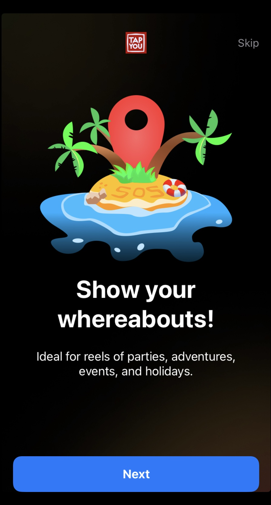
    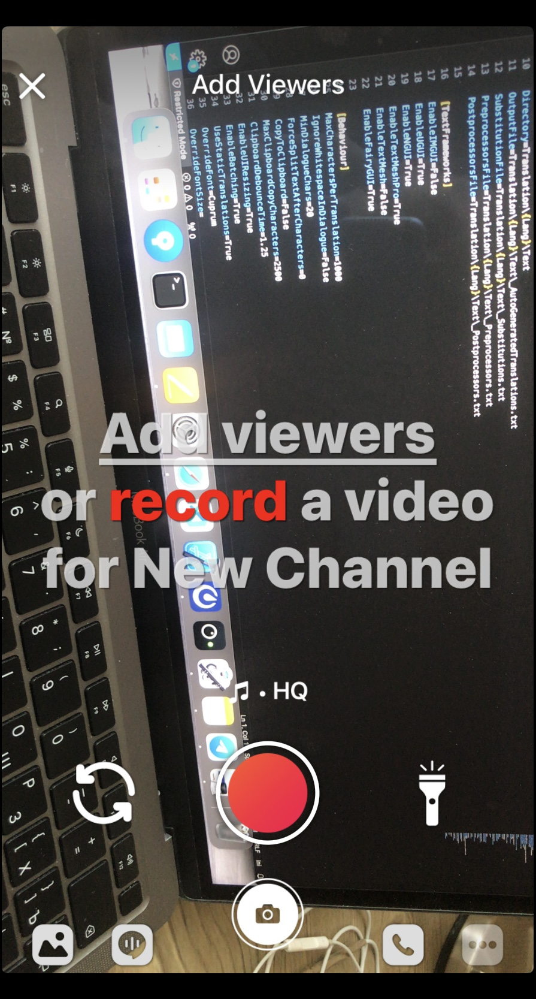
    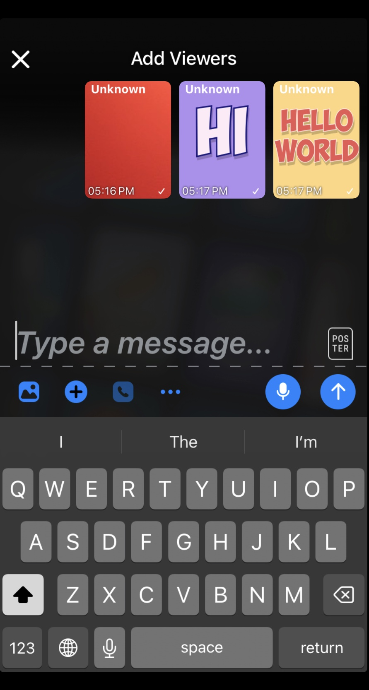
    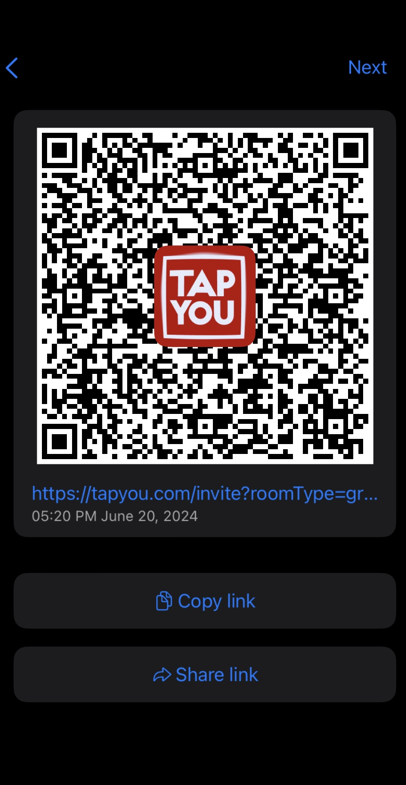

#### Objective: 
The app's onboarding process was inefficient, the localization process took a long time for developers, and the UI inconsistent

#### My Role: 
My focus was on elevating the visual interface, automating key development processes, and ensuring a seamless and dynamic user experience.

#### What I Did:
- Created new onboarding screens for the app with SwiftUI and Metal frameworks.
- Automated localization process with a script in Swift.
- Collaborated with designers to refine screens, ensuring pixel-perfect UI and frame-perfect animations

#### Results: 
Redesigned onboarding screens increased short-term user retention by 30%. Localization automation sped up processes by 10x freeing up valuable developer resources. Collaboration with designers ensured UI/UX precision, enhancing user satisfaction.

<b>Stack:</b> SwiftUI/UIKit, Combine/RxSwift, CoreData, MVP/MVVM, XCTest/XCUITest, AVFoundation, CoreGraphics, Metal

### Find My Kids | Aug 2019 - May 2022

Children safety platform.

    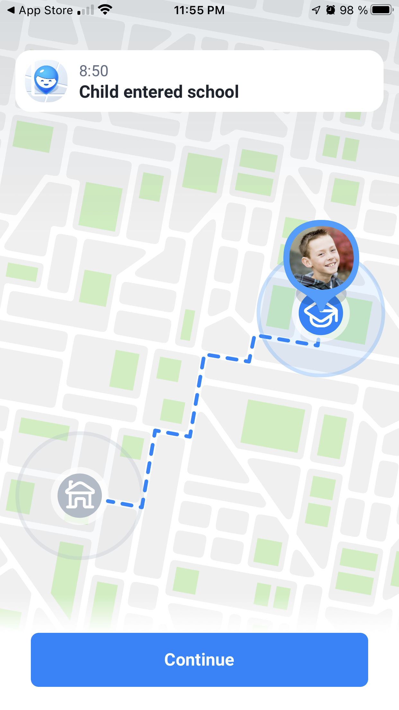
    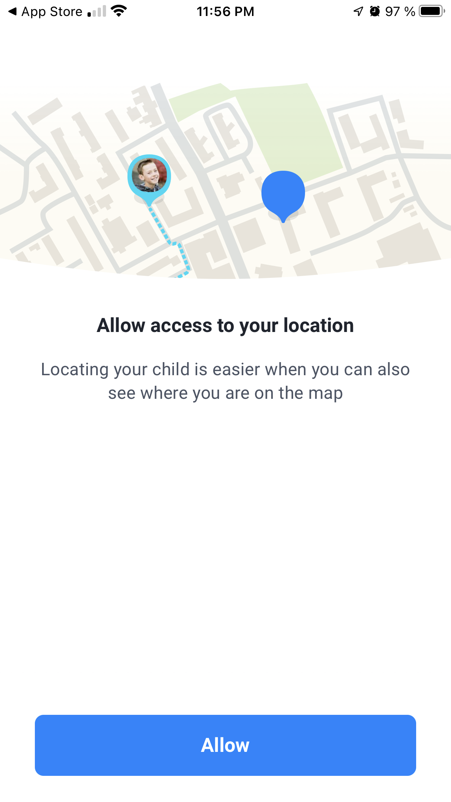
    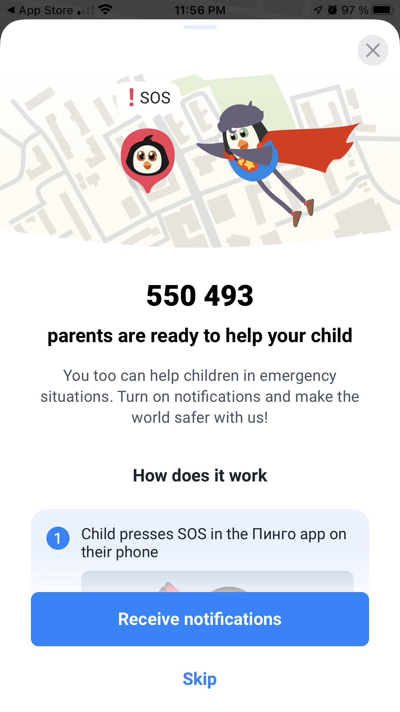
    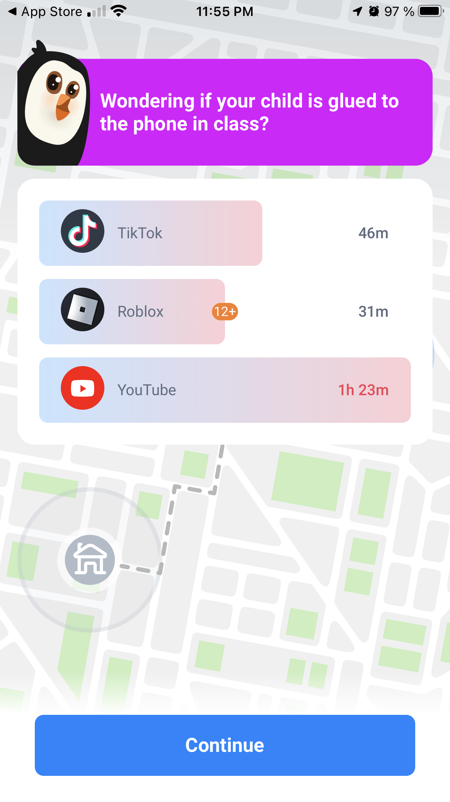

#### Objective: 
The application's core functionality(geolocation) was broken after a major iOS update. Also, the app was banned by the Apple Review team for using undocumented API. These problems had to be solved in a short time.

#### My Role: 
I was responsible for reimplementing the geolocation functionality and interacting with the Apple Review team. Also, I was responsible for refactoring legacy code, onboarding, and mentoring new developers.

#### What I Did:
- Reimplemented critical geolocation functionality in less than 1 month, using CoreLocation, CoreMotion, PushKit
- Developed and supervised the process of code migration from Objective-C to Swift using automation tools and unit tests, making it fast and bug-free
- Interacted with the Apple Review team to unban the app in the App Store, found out the problem, and made all necessary changes in less than a week
- Led a team of 3 iOS developers

#### Results: 
Efficiently resolved geolocation issues and app ban within a month, enhancing app functionality and compliance. Streamlined code migration and mentored a team, boosting development speed and performance.

<b>Stack:</b> UIKit, CoreData, VIPER, XCTest/XCUITest, CoreLocation, CoreMotion, VOIP, SnapKit

### X-GPS | Jul 2018 - Aug 2019

Location-based IoT solution of 2 iOS apps - tracker and monitor.

    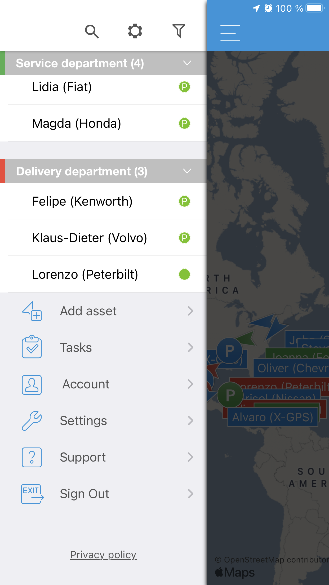
    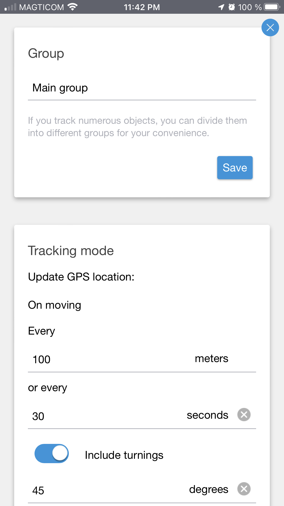
    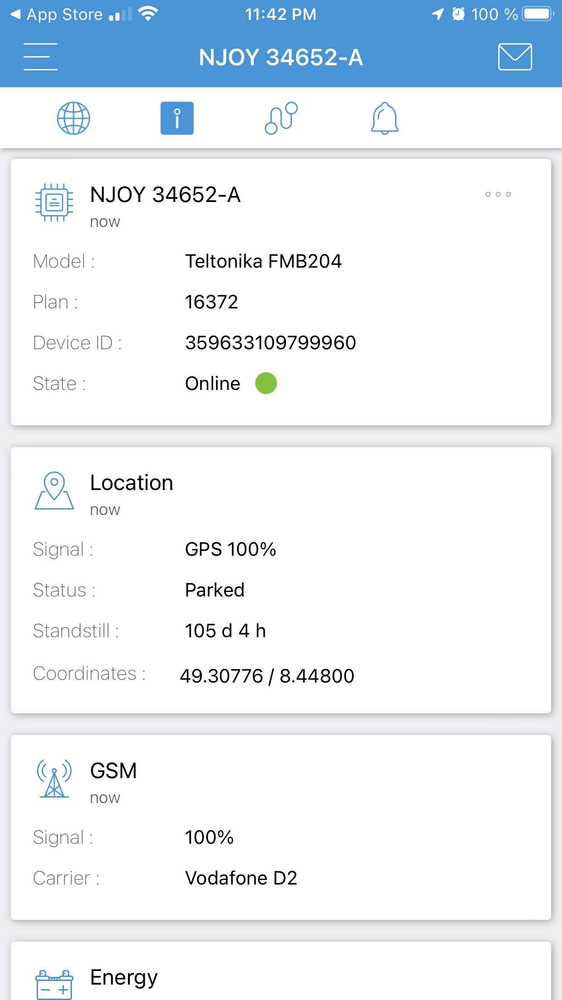
    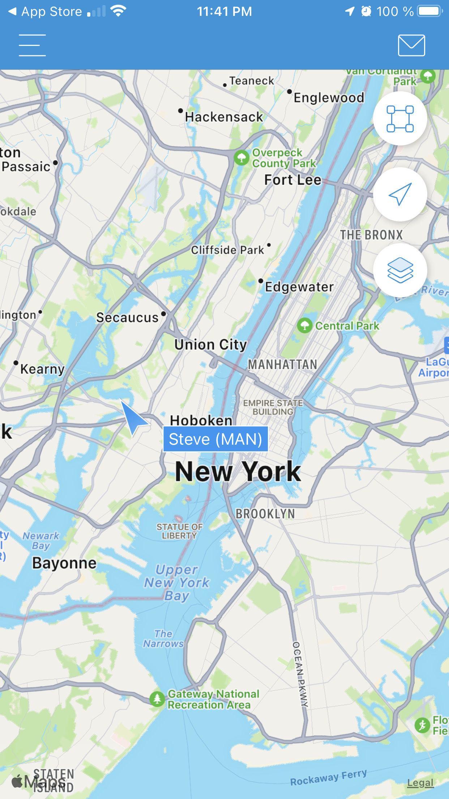

#### Objective: 
The company's application had heavy Objective-C legacy, and was hard to maintain and develop. It was necessary to migrate the code base to Swift to make it more friendly for new developers. Also, the code base needed refactoring to improve the feature development speed and reduce the bugs amount.

#### My Role: 
My responsibilities included code base refactoring and migration, developing new features, and reducing bugs.

#### What I Did:
- Refactored the app’s single storyboard containing approximately 150 ViewControllers into 25 separate storyboards, and implemented router entities instead of segue usage.
- Participated in migration of existing code base from Objective-C to Swift.
- Was working on adding new features to the app.

#### Results: 
Storyboard refactoring significantly decreased storyboard loading time(up to 95%), simplified adding changes in routing and made code more clear and readable. Successfully migrated more than 200 files to Swift manually and using automation tools. Added several important business features including task assignment for employees and time tracking which expanded the app’s user base.

<b>Stack:</b> UIKit, CoreData, MVC, Objective-C, XCTest/XCUITest

### Delo Bank | Jul 2017 - Jul 2018

Leading banking app for entrepreneurs.

    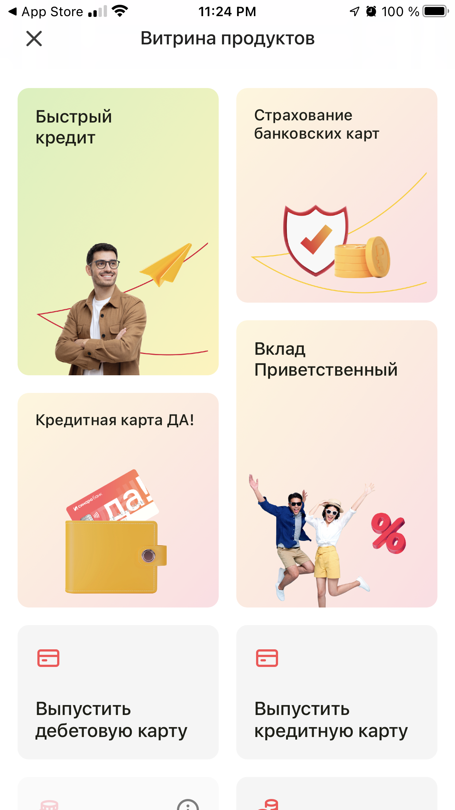
    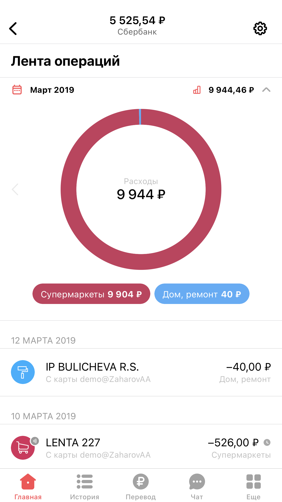
    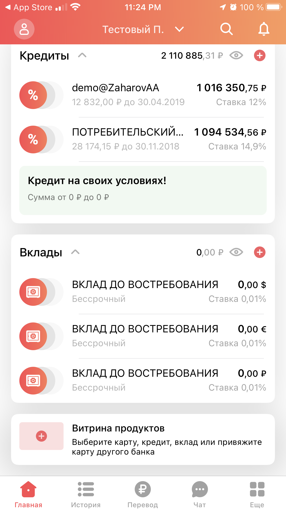
    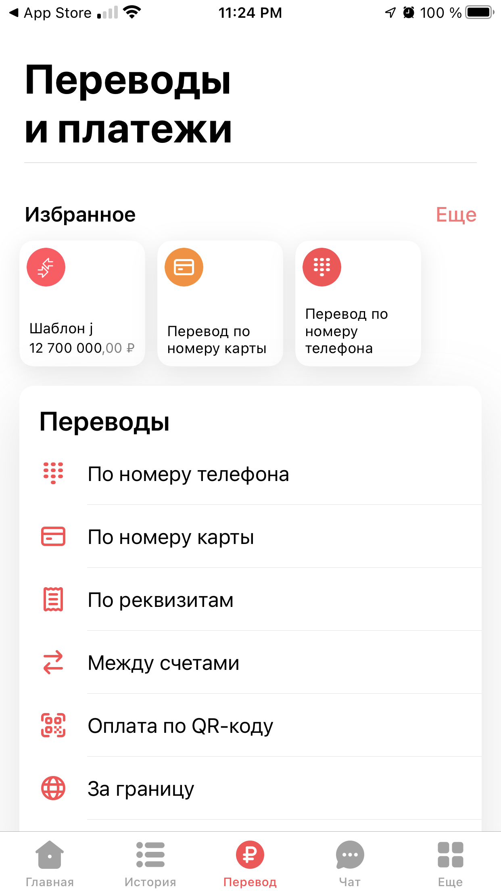

#### Objective: 
The company's application needed to evolve to meet modern standards for functionality and user interface. Additionally, the push notification module had a heavy legacy and a high volume of bugs.

#### My Role: 
My responsibilities included enhancing push notification functionalities, creating new screens, and reducing bugs.

#### What I Did:
- Created more than 20 new screens including UI (auto layout & manual layout) and business logic using the RxSwift framework.
- Rewritten from scratch the Push notifications module with heavy legacy. Added rich notifications support.
- Successfully reduced the bugs backlog. 
- Participated in code review.

#### Results: 
Added several important features such as Transaction feed and Showcase. Made the Push notifications module easy to maintain and expandable, and also was responsible for supporting it. Increased the percentage of trouble-free app users from 90% to 94%.

<b>Stack:</b> UIKit, RxSwift, Realm, MVVM, XCTest/XCUITest

### Callina | Dec 2016 - Jul 2017

Mobile app and online service for recording phone calls on your iPhone.

    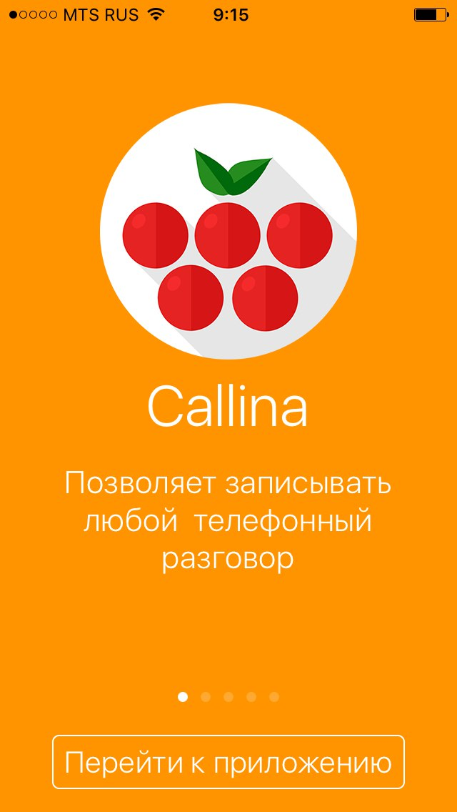
    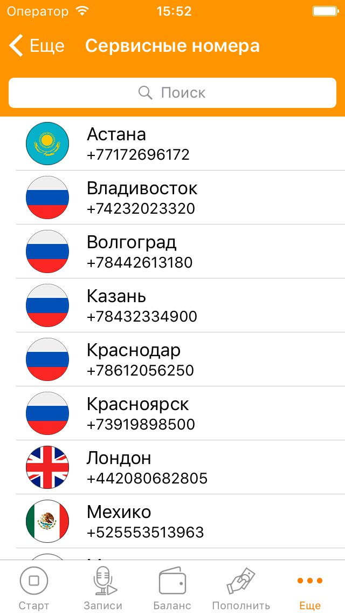
    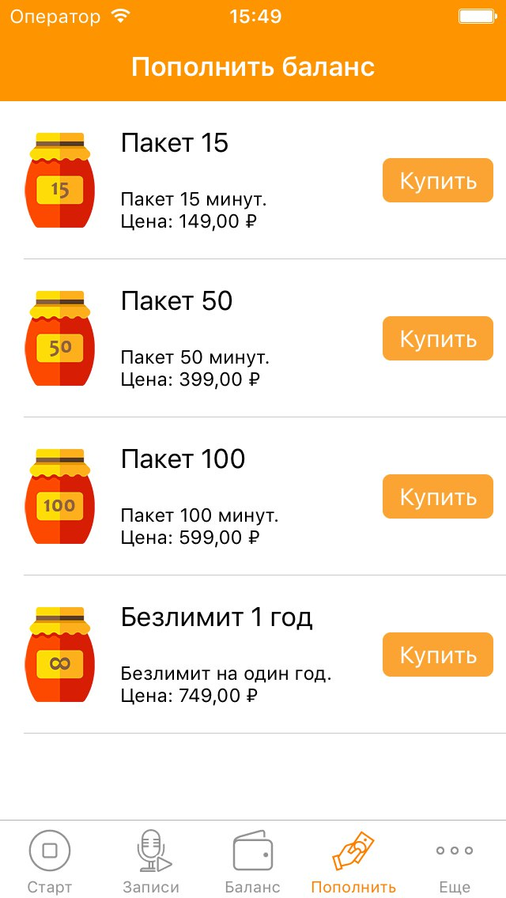
    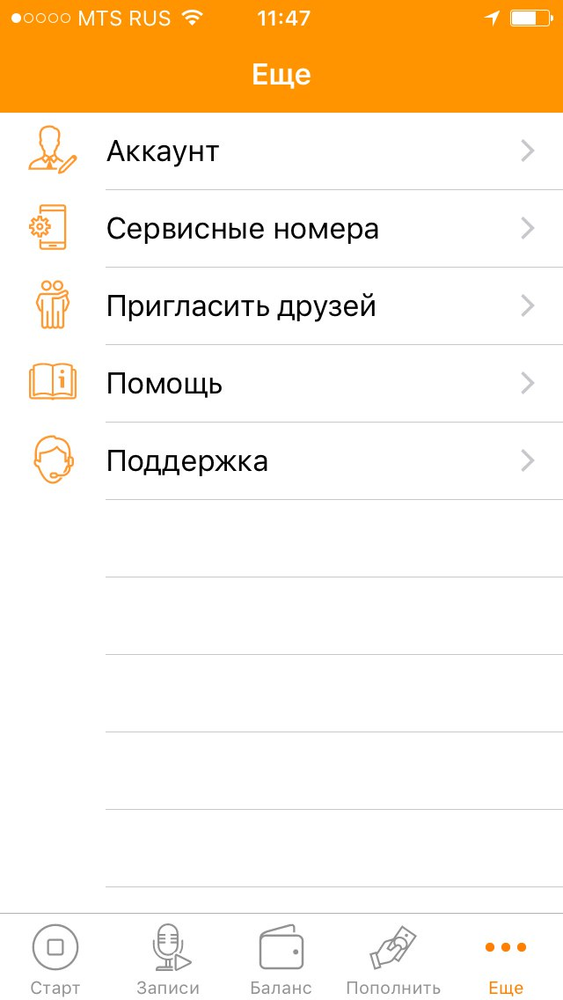

#### Objective:
 The company aimed to develop an app for recording phone calls on iOS devices, a feature not available by default.

#### My Role: 
I was tasked with developing the app from scratch, which involved designing the user interface following Apple's HIG(Human Interface Guidelines), creating assets, and evaluating the viability of implementing key features.

#### What I did:
- Developed the app from scratch, in compliance with Apple's HIG(Human Interface Guidelines) for designing UI. 
- The app used a dedicated VOIP service to record phone calls. I used CallKit to track the current call state. 
- Implemented downloading of saved calls from our server with URLSession.
- Created a built-in audio player to listen to downloaded calls with the help of AVFoundation. 
- Added the “file sharing” and “export” features.
- Added in-app purchases.

#### Results:
The app was successfully released in the App Store with all the planned features, had a high crash-free rate (over 98%), and was successfully supported by other developers for several years.

<b>Stack:</b> UIKit, CoreData, MVC, XCTest/XCUITest, AVFoundation, CallKit, VOIP

## Volunteering

### Esports Wellness | Apr 2024 - Now
An Android app in Kotlin for tracking mobile device usage time and assessing the level of gaming addiction.

Target audience: mobile gaming enthusiasts aged 13-22.

Server-side data processing from mobile devices, including gaming addiction levels determined by neural network analysis.

I'm a solo developer creating the app from scratch.

    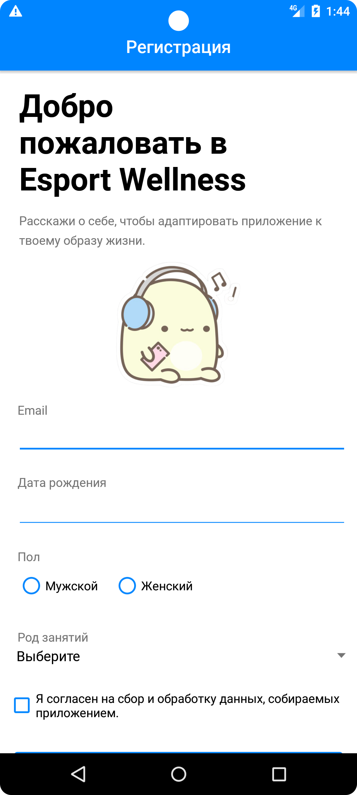
    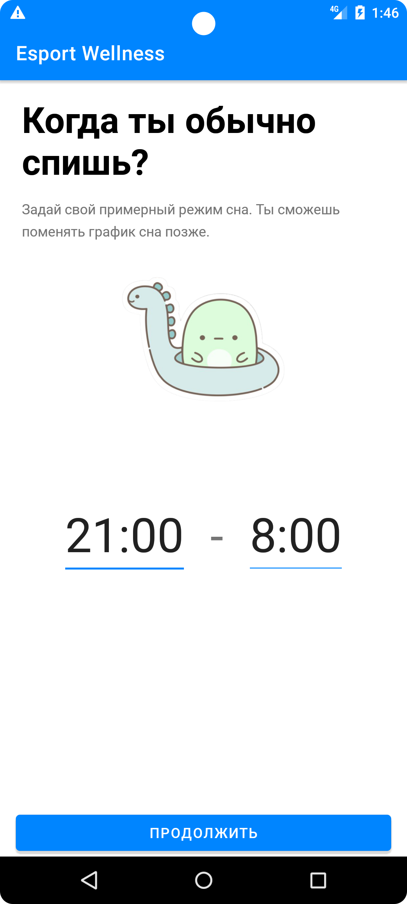
    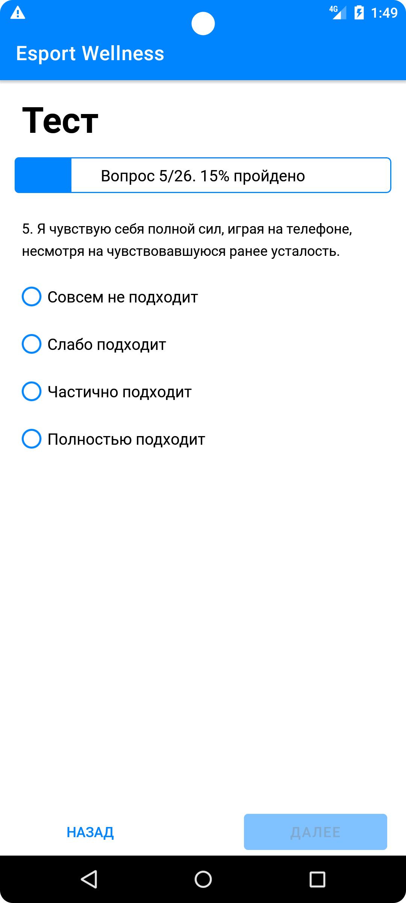
    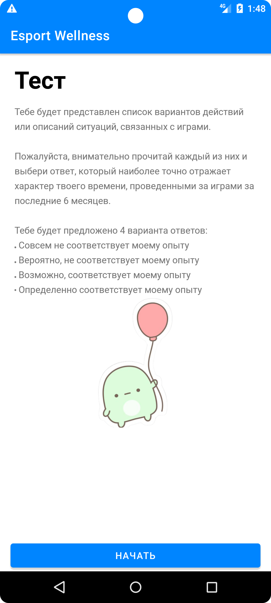

 

 

